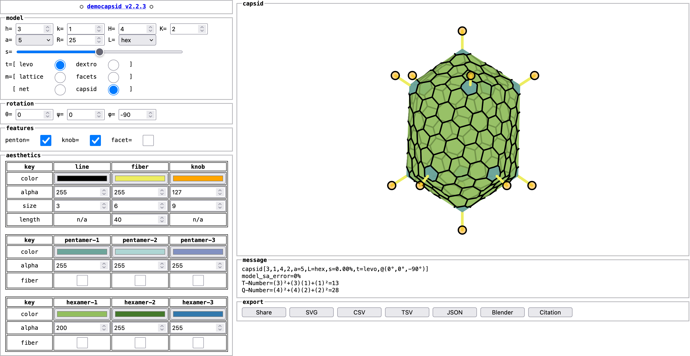

# Abstract

This work implements Caspar-Klug Theory to generate high-quality, vectorized capsid cartoons in the browser and is the first online tool that provides comprehensive style customization, geometry, and SVG export of icosahedra and nets with different lattice structures.

# Run

-   Run democapsid (v2.1.2): [https://dnanto.github.io/democapsid/app.html](https://dnanto.github.io/democapsid/app.html).



# build

```bash
npm run clean && \
npm run minify && \
npm run update && \
npm run zip && \
npm run tar
```

# Paper

-   Negrón, D. A. (2021). Vectorized Capsid Rendering in the Browser with Capsid.js (p. 2020.12.02.408252). https://doi.org/10.1101/2020.12.02.408252
-   Negrón, D. A. (2021). Molecular Clock Analysis of Human Adenovirus [Ph.D., George Mason University]. In ProQuest Dissertations and Theses. http://www.proquest.com/docview/2572612100/abstract/9972F7D348C34013PQ/1

# Poster

-   [ASM Microbe 2022 @ DC](https://github.com/dnanto/democapsid/blob/master/poster/poster2022.pdf)
-   [Spring 2021 GMU SSB Student Research Day 2021 @ GMU](https://github.com/dnanto/democapsid/blob/master/poster/poster2021.pdf)
-   [Fall 2020 SSB Student Research Day 2020 @ GMU](https://github.com/dnanto/democapsid/blob/master/poster/poster2020.pdf)

# Demoscene

-   5th place at Demosplash 2021 for the combined demo/intro category (https://www.pouet.net/prod.php?which=90296)

# Citation

-   Please comment on or [cite](https://github.com/dnanto/democapsid/blob/master/CITATION.cff) the preprint at [bioRxiv](https://www.biorxiv.org/content/10.1101/2020.12.02.408252v1), which is Chapter 2 of the [dissertation](http://www.proquest.com/docview/2572612100/abstract/9972F7D348C34013PQ/1).
-   This work previously went by the name "capsid.js" and is now "democapsid".

# Cited by

-   Hamann, M. V.; Beschorner, N.; Vu, X.-K.; Hauber, I.; Lange, U. C.; Traenkle, B.; Kaiser, P. D.; Foth, D.; Schneider, C.; Büning, H.; Rothbauer, U.; Hauber, J. Improved Targeting of Human CD4+ T Cells by Nanobody-Modified AAV2 Gene Therapy Vectors. PLOS ONE 2021, 16 (12), e0261269. https://doi.org/10.1371/journal.pone.0261269.

# References

-   Twarock, R., & Luque, A. (2019). Structural puzzles in virology solved with an overarching icosahedral design principle. Nature Communications, 10(1), 4414. https://doi.org/10.1038/s41467-019-12367-3
-   Lehni, J., & Puckey, J. (2011). Paperjs/paper.js [JavaScript]. Paper.js. https://github.com/paperjs/paper.js
-   Luque, A., & Reguera, D. (2010). The Structure of Elongated Viral Capsids. Biophysical Journal, 98(12), 2993–3003. https://doi.org/10.1016/j.bpj.2010.02.051
-   Moody, M. F. (1965). The shape of the T-even bacteriophage head. Virology, 26(4), 567–576. https://doi.org/10.1016/0042-6822(65)90319-3
-   Caspar, D. L., & Klug, A. (1962). Physical principles in the construction of regular viruses. Cold Spring Harbor Symposia on Quantitative Biology, 27, 1–24. https://doi.org/10.1101/sqb.1962.027.001.005

# License

-   [MIT License](https://github.com/dnanto/democapsid/blob/master/LICENSE)
